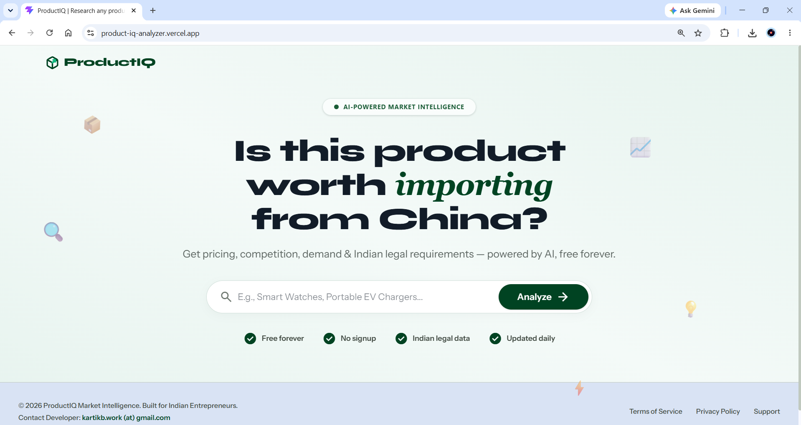

<div align="center">
<h1>📦 ProductIQ</h1>

<h3>AI-powered market intelligence for Indian importers &amp; e-commerce sellers</h3>

<p>
Type a product name. Get pricing, margins, legal compliance, competitor data, demand trends,<br/>
and a straight <b>BUY / CAUTION / SKIP</b> verdict — before you spend a rupee on stock.
</p>

<p>
  <a href="https://product-iq-analyzer.vercel.app/"></a>
  <a href="#-getting-started"></a>
  <a href="./DEPLOYMENT.md"></a>
</p>

<p>
  
  
  
  
  
  
  
  
</p>

</div>

---

### 📑 Table of Contents

<p>
<a href="#-what-it-does">What it does</a> ·
<a href="#-screenshots--demo">Screenshots</a> ·
<a href="#%EF%B8%8F-tech-stack">Tech Stack</a> ·
<a href="#-project-structure">Project Structure</a> ·
<a href="#-api-endpoints">API</a> ·
<a href="#-getting-started">Getting Started</a> ·
<a href="#-deployment">Deployment</a> ·
<a href="#-license">License</a>
</p>

---

## 🧠 What it does

Give it a product name, and ProductIQ returns a structured report containing:

| | | |
|---|---|---|
| 🎯 **IQ Score & Verdict** | BUY / CAUTION / SKIP call with a rationale | 📊 **Market Performance** | category, market size, rating, review volume, demand level, entry difficulty |
| 💰 **Pricing & Margins** | landed cost, GST, customs, MSRP, gross margin %, ROI %, breakeven units | ⚖️ **Legal & Compliance** | BIS certification, HSN code, GST %, DGFT status, mandatory/conditional checklist |
| 🏆 **Competitive Landscape** | platform-wise listings, brand market share, top products by price/rating/reviews | 🧩 **Variants & Features** | common variants and feature list for the product |
| 📈 **Demand Trends** | Google Trends interest-over-time data | 🍂 **Seasonality** | seasonality label + timing advice |
| 🧭 **SWOT Analysis** | strengths, weaknesses, opportunities, threats | 💡 **Strategy Advice** | a short, actionable recommendation |

Reports are cached in **Redis** and persisted to **Supabase**, so repeat lookups for the same product are fast, and a history of the last 20 analyzed products is available via the API.

---

## 🖼️ Screenshots & Demo

<p align="center">
  <a href="https://drive.google.com/file/d/14r89F1socSBz19faL6eSfEb-6ckjQy5-/view?usp=sharing">
    
    <br/>
    
  </a>
</p>

<details>
<summary><b>📷 Click to expand the full UI walkthrough</b></summary>
<br/>

**Search / Landing Page**


**Report Generation Progress**


**Market Report Overview**


</details>

---

## ⚙️ Tech Stack

<div align="center">

| Layer | Stack |
|---|---|
| **Frontend** | React 19 · Vite 8 · Tailwind CSS 4 · Recharts · jsPDF · Axios |
| **Backend** | FastAPI (Python) · Google Gemini (`google-generativeai`) · Serper.dev · pytrends |
| **Data** | Supabase (persistence) · Upstash Redis (caching) |
| **Hosting** | Vercel (frontend) · Render (backend, Docker or Python service) |

</div>

> Deliberately zero/low-cost — the entire stack runs comfortably on free tiers.

---

## 🗂️ Project Structure

<details>
<summary><b>Click to expand the directory tree</b></summary>

```
ProductIQ/
├── backend/
│   ├── main.py            # FastAPI app: endpoints, Gemini prompting, data aggregation
│   ├── legal_data.json    # Static BIS/HSN/GST/DGFT lookup database
│   ├── requirements.txt
│   └── Dockerfile
├── frontend/
│   ├── src/
│   │   ├── App.jsx
│   │   └── ...
│   ├── package.json
│   └── vite.config.js
├── ProductIQ UI/          # Design references / UI screens
├── schema.sql             # Supabase table definitions
└── DEPLOYMENT.md          # Full deployment guide (Render + Vercel)
```

</details>

---

## 🔌 API Endpoints

| Method | Endpoint       | Description                                             |
|--------|----------------|-----------------------------------------------------------|
| `GET`    | `/api/ping`    | Health check                                               |
| `POST`   | `/api/analyze` | Analyze a product and return a full `MarketReport`         |
| `GET`    | `/api/history` | Fetch the last 20 previously analyzed products             |

`/api/analyze` follows a cache-first strategy: **Redis → Supabase → fresh generation** (Serper + Trends + Gemini, run concurrently), falling back to a mock report generator if Gemini fails.

---

## 🚀 Getting Started

### Prerequisites
- Python 3.10+
- Node.js 18+
- API keys: Google Gemini, Serper.dev, Supabase, Upstash Redis

<details open>
<summary><b>1️⃣ Clone the repo</b></summary>

```bash
git clone https://github.com/kartikbansalx/ProductIQ.git
cd ProductIQ
```
</details>

<details open>
<summary><b>2️⃣ Backend setup</b></summary>

```bash
cd backend
pip install -r requirements.txt
```

Create a `.env` file in the project root:
```env
GEMINI_API_KEY=your_gemini_key
SERPER_API_KEY=your_serper_key
SUPABASE_URL=your_supabase_url
SUPABASE_ANON_KEY=your_supabase_anon_key
UPSTASH_URL=your_upstash_url
UPSTASH_TOKEN=your_upstash_token
```

Set up the database by running `schema.sql` in the Supabase SQL Editor, then start the API:
```bash
uvicorn main:app --host 0.0.0.0 --port 8000 --reload
```
</details>

<details open>
<summary><b>3️⃣ Frontend setup</b></summary>

```bash
cd frontend
npm install
```

Create a `.env` file in `frontend/`:
```env
VITE_BACKEND_URL=http://localhost:8000
```

Then run:
```bash
npm run dev
```
</details>

---

## ☁️ Deployment

ProductIQ is designed to deploy for free, and is currently live at **[product-iq-analyzer.vercel.app](https://product-iq-analyzer.vercel.app/)**:

- **Backend** → [Render](https://render.com) (Python web service or Docker)
- **Frontend** → [Vercel](https://vercel.com) (Vite static build)

Full step-by-step instructions, including environment variable setup and Supabase table creation, are in **[`DEPLOYMENT.md`](./DEPLOYMENT.md)**.

---

## 📄 License

This project currently has no explicit license. Contact the repository owner before reuse or distribution.

---

<div align="center">
<sub>Built by <a href="https://github.com/kartikbansalx">Kartik Bansal</a></sub>
</div>
